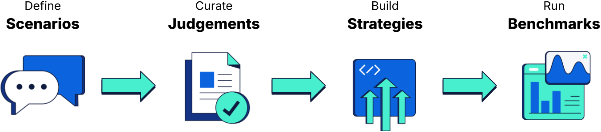

# Elasticsearch Relevance Studio

*You know, for search relevance.*

Elasticsearch Relevance Studio guides you in the best practices of **search relevance engineering** so you can deliver amazing search experiences.

&nbsp;

<picture>
  <source media="(prefers-color-scheme: dark)" srcset="./src/ui/img/process-white.png">
  
</picture>

&nbsp;

### AI ready :sparkles:

Elasticsearch Relevance Studio is equipped with an [MCP Server](docs/reference/architecture.md#recommended-setup-with-mcp) to enable Agentic AI workflows. This means you can automate the entire lifecyle of search relevance engineering &ndash; scaling up your operations much faster than possible with humans alone.

### Get started

**[Read the docs to get started](https://elastic.github.io/relevance-studio/#/docs/setup/quickstart)**
