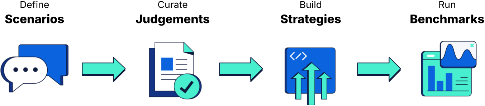

<h1 style="font-size: 24px;">Elasticsearch Relevance Studio</h1>

*You know, for search relevance.*

    

        <code style="background: none; color: #48efcf; font-size: 14px; font-weight: 600; white-space: nowrap; overflow-x: auto;">curl -fsSL https://ela.st/relevance-studio-quickstart | sh</code>
        <button onmouseenter="this.querySelector('.copy-icon').style.stroke='#fff'" onmouseleave="this.querySelector('.copy-icon').style.stroke='#4ea7ff'" onclick="navigator.clipboard.writeText('curl -fsSL https://ela.st/relevance-studio-quickstart | sh').then(function(){var b=this;b.querySelector('.copy-icon').style.visibility='hidden';b.querySelector('.check-icon').style.visibility='visible';setTimeout(function(){b.querySelector('.copy-icon').style.visibility='visible';b.querySelector('.check-icon').style.visibility='hidden';},1500);}.bind(this))" style="background: none; border: none; cursor: pointer; padding: 4px; flex-shrink: 0; position: relative; width: 28px; height: 28px;" title="Copy to clipboard">
            <svg class="copy-icon" width="20" height="20" viewBox="0 0 24 24" fill="none" stroke="#4ea7ff" stroke-width="2" stroke-linecap="round" stroke-linejoin="round" style="transition: stroke 0.2s; position: absolute; top: 4px; left: 4px;"><rect x="9" y="9" width="13" height="13" rx="2" ry="2"/><path d="M5 15H4a2 2 0 0 1-2-2V4a2 2 0 0 1 2-2h9a2 2 0 0 1 2 2v1"/></svg>
            <svg class="check-icon" width="20" height="20" viewBox="0 0 24 24" fill="none" stroke="#48efcf" stroke-width="2" stroke-linecap="round" stroke-linejoin="round" style="position: absolute; top: 4px; left: 4px; visibility: hidden;"><rect x="9" y="9" width="13" height="13" rx="2" ry="2"/><path d="M5 15H4a2 2 0 0 1-2-2V4a2 2 0 0 1 2-2h9a2 2 0 0 1 2 2v1"/><polyline points="13 14 15.5 16.5 19.5 12.5"/></svg>
        </button>
    

[<button class="get-started">Get started</button>](docs/guide/quickstart) [Learn more](docs/guide/welcome.md)

<h3>Search is more relevant than ever</h3>

Elasticsearch Relevance Studio manages the lifecycle of **search relevance engineering** so you can deliver amazing search experiences.

<h3>AI ready :sparkles:</h3>

Elasticsearch Relevance Studio is equipped with an [MCP Server](docs/reference/architecture.md#recommended-setup-with-mcp) to enable Agentic AI workflows. This means you can automate the entire lifecycle of search relevance engineering &ndash; scaling up your operations much faster than possible with humans alone.

---

<h4 style="font-size: 48px; font-weight:200; margin-bottom: 30px;">Spotlight</h4>

Let's look at some of the impressive features of Elasticsearch Relevance Studio. Click any image to zoom in.

<h6 style="margin-bottom: 0;">Curating judgements</h6>

<small>*A ground truth data set is your most important asset in measuring search relevance. Elasticsearch Relevance Studio provides an intuitive human interface for judging the relevance of your documents to your search scenarios – and tools that AI agents can use to automate and scale the process. This screenshot shows Claude Desktop working on a set of [judgements](docs/guide/concepts.md#judgements) and a human reviewing its choices in the application.*</small>

---

<h6 style="margin-bottom: 0;">Building strategies</h6>

<small>*You can build and test the search [strategies](docs/guide/concepts#strategies) that you intend to benchmark and get immediate visual feedback on the quality of their results. As you work on them, you can judge the documents that appear in the search results of a test run for a chosen scenario.*</small>

---

<h6 style="margin-bottom: 0;">Running benchmarks</h6>

<small>*As you build out your scenarios, judgements, and strategies, you can run [benchmarks](docs/guide/concepts.md#benchmarks) that evaluate the relevance of your strategies. The human interface presents a concise set of analytics that rank your strategies by key relevance metrics such as NCDG, Precision, and Recall. Re-run benchmarks to measure the progress of your strategies as you change them.*</small>

<small>*Drill down into the performance of strategies by scenarios for a chosen relevance metric. Group the metric by strategy tags and/or scenario tags to get a broader sense of which kinds of strategies perform well with which kinds of scenarios.*</small>

<small>*The benchmarks report any unrated documents that matched your strategies and scenarios. This helps you improve the coverage and quality of your ground truth judgements and, by extension, the trustworthiness of your relevance metrics.*</small>

<small>*You can inspect the state of the indices, strategies, scenarios, and judgements as they existed at runtime. They include deterministic fingerprints for efficient change detection. This helps you find and explain the reasons for changes in relevance metrics between runs.*</small>

---

## Ready to start?

[<button class="get-started">Get started</button>](docs/guide/quickstart) [Learn more](docs/guide/welcome.md)